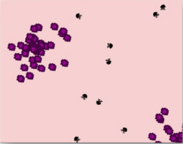

# Gym Environment for Swarm Bots

## Abstract

The challenges in cancer therapies are that they induce side effects by traveling throughout the patient's body via the bloodstream and destroying both healthy and malignant cells. To reduce the risk of side effects, the therapy should solely target malignancies.

Swarm robotics offers the potential to advance personalized precision medicine and cancer therapy.

 

Our study attempts to provide a customizable gym environment with collisions and physics that can be used to test and benchmark multi-agent path-planning algorithms for targeting cancer cells.

## Methodology

We created a multi-agent gym environment comprised of three entities: Nano-bots, RBCs, and Tumor cells.
The Nano-bots' goal is to approach and eliminate all the Tumor cells while avoiding collisions with other entities.

The bots are rewarded globally depending on how distant they are from the Tumor group and rewarded individually based on collisions with RBCs or other Nano-bots and eliminating the Tumor cells.

 

The number of Nano-bots, RBC's, Tumor cells, and tumor groups are modifiable

Action Space :- [ Forward_acceleration, Backward_Acceleration, Left_Rotation , Right_Rotation ]

Observation space for each bot:[ bot_position , bot_velocity, relative_position_bots , relative_position_rbcs , relative_position_tumor_cells]

The Gym environment is rendered using PyGame.

## Conclusion

This environment is not only limited to the research of cancer treatment. Due to its flexibility, it can be used for testing multi-agent path-planning algorithms where the RBCs can be treated as dynamic obstacles and the tumors as dynamic landmarks. These can be very easily changed to suit the problem at hand.

## References

[1] Simple Spread: MPE in which the agents must learn to cover all the landmarks while avoiding collisions.

[2] OpenAI Gym

[3] Multi-agent system simulation of nano-robotic drug delivery in tumors of body tissues

[4] Assessment of Applying Path Planning Technique to Nanorobots in a Human Blood Environment
